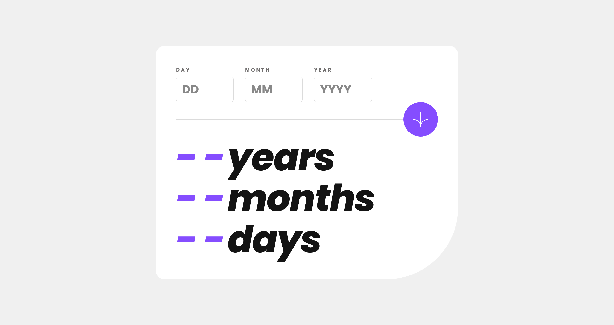

# Frontend Mentor - Age calculator app solution

This is a solution to the [Age calculator app challenge on Frontend Mentor](https://www.frontendmentor.io/challenges/age-calculator-app-dF9DFFpj-Q). Frontend Mentor challenges help you improve your coding skills by building realistic projects. 

## Table of contents

- [Frontend Mentor - Age calculator app solution](#frontend-mentor---age-calculator-app-solution)
  - [Table of contents](#table-of-contents)
  - [Overview](#overview)
    - [The challenge](#the-challenge)
    - [Screenshot](#screenshot)
      - [Error states :](#error-states-)
    - [Links](#links)
  - [My process](#my-process)
    - [Built with](#built-with)
    - [What I learned](#what-i-learned)
    - [Continued development](#continued-development)
    - [Useful resources](#useful-resources)
  - [Author](#author)

## Overview

### The challenge

Users should be able to:

- View an age in years, months, and days after submitting a valid date through the form
- Receive validation errors if:
  - Any field is empty when the form is submitted
  - The day number is not between 1-31
  - The month number is not between 1-12
  - The year is in the future
  - The date is invalid e.g. 31/04/1991 (there are 30 days in April)
- View the optimal layout for the interface depending on their device's screen size
- See hover and focus states for all interactive elements on the page
- **Bonus**: See the age numbers animate to their final number when the form is submitted

### Screenshot

Desktop

Mobile

Valid state

#### Error states :

- Missing fields

- Invalid date

- Invalid year

### Links

- Solution URL: [Add solution URL here](https://your-solution-url.com)
- Live Site URL: [Add live site URL here](https://your-live-site-url.com)

## My process

### Built with

- HTML5
- CSS/Sass
- Bootstrap CSS
- Mobile-first workflow

### What I learned

It's nothing very impressive, but I discovered the [caret-color](https://developer.mozilla.org/en-US/docs/Web/CSS/caret-color) CSS property, which I had never used before. I've also changed the placeholders color with the [::placeholder](https://developer.mozilla.org/en-US/docs/Web/CSS/::placeholder) CSS pseudo-element. It was also the first time I used it.

### Continued development

I wanted to do the JavaScript part of this project by myself to practice form validation, but I think it would have been more optimized with a JavaScript framework. I definitely see that I need to progress with algorithms and to improve my logic.

### Useful resources

- [Example resource 1](https://www.example.com) - This helped me for XYZ reason. I really liked this pattern and will use it going forward.
- [Example resource 2](https://www.example.com) - This is an amazing article which helped me finally understand XYZ. I'd recommend it to anyone still learning this concept.

## Author

- Frontend Mentor - [@manondupriez](https://www.frontendmentor.io/profile/manondupriez)